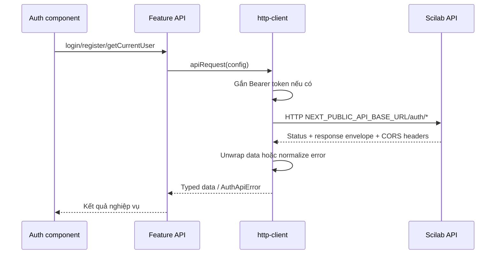
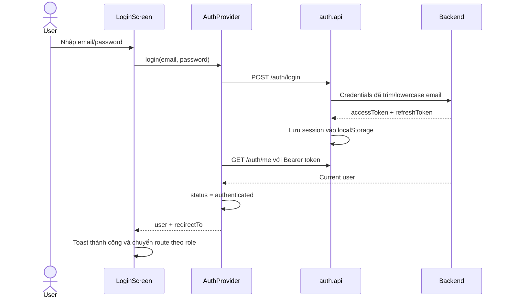
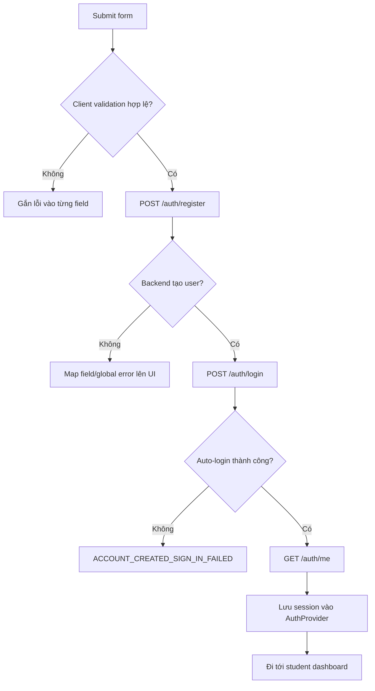
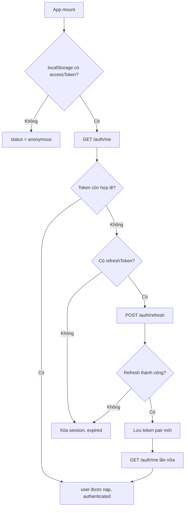

# Kiến trúc Feature-based và luồng Authentication

Tài liệu này giải thích cách tổ chức frontend trong `apps/web` và cách luồng
đăng ký, đăng nhập, khôi phục phiên, phân quyền và đăng xuất đang hoạt động.
Nội dung mô tả code hiện tại, không phải kiến trúc dự kiến trong tương lai.

## 1. Bức tranh tổng thể

Frontend dùng Next.js App Router nhưng nghiệp vụ không được viết trực tiếp hết
trong `src/app`. Mỗi nghiệp vụ lớn được gom thành một **feature** độc lập.

```text
apps/web/src/
|-- app/                  # Route và layout của Next.js
|-- features/             # Nghiệp vụ theo từng feature
|   `-- auth/
|       |-- api/          # Gọi API, mapping và lưu token
|       |-- components/   # UI và tương tác của auth
|       |-- testing/      # Tiện ích chỉ dùng cho test
|       |-- types/        # Kiểu dữ liệu thuộc auth
|       `-- views/        # Điểm gom/export view theo vai trò
|-- providers/            # State dùng trên toàn ứng dụng
`-- shared/               # Thành phần dùng chung, không thuộc riêng feature nào
    |-- api/
    |-- components/
    |-- constants/
    |-- schemas/
    `-- utils/
```

Luồng phụ thuộc nên đi theo hướng:

```text
app -> feature components -> feature api -> shared api -> Scilab API
                     |              |
                     v              v
               feature types   token storage

providers -> feature api/types + shared constants
features  -> shared
shared    -X-> features (ngoại trừ http-client hiện cần AuthApiError/token helper)
```

Mục tiêu là thay đổi một nghiệp vụ trong folder của chính nó, tránh để page,
component hoặc helper dùng chung chứa lẫn business logic.

## 2. Trách nhiệm của từng vùng

### `src/app`

`src/app` là lớp routing của Next.js:

- `app/auth/login/page.tsx` ánh xạ URL `/auth/login` tới màn hình đăng nhập.
- `app/auth/register/page.tsx` ánh xạ URL `/auth/register` tới màn hình đăng ký.
- `app/layout.tsx` lắp `ThemeProvider`, `QueryProvider`, `AuthProvider` và
  `Toaster` cho toàn bộ ứng dụng.

Page nên mỏng: nhận route params khi cần, render feature tương ứng, không tự gọi
API và không tự quản lý token.

### `src/features/<feature>`

Mỗi feature chứa mọi thứ chỉ có ý nghĩa trong nghiệp vụ đó. Với auth:

| Folder        | Trách nhiệm                                             | Ví dụ                               |
| ------------- | ------------------------------------------------------- | ----------------------------------- |
| `api/`        | HTTP operation, mapper, error helper, token persistence | `auth.api.ts`, `auth-mappers.ts`    |
| `components/` | Form, loading/error state, route guard                  | `LoginScreen.tsx`, `RouteGuard.tsx` |
| `types/`      | Request, response, user, session, role                  | `auth.types.ts`                     |
| `testing/`    | Factory và helper cho test                              | `auth-test-utils.ts`                |
| `views/`      | Export view cấp feature hoặc theo role                  | `student/index.ts`                  |

Component gọi một hàm có ý nghĩa nghiệp vụ như `registerAccount()` hoặc
`login()`. Component không cần biết URL backend, Axios interceptor hay cấu trúc
response envelope.

### `src/providers`

Provider quản lý state xuyên nhiều route:

- `AuthProvider` giữ `user`, `session`, `status` và các action auth.
- `QueryProvider` cung cấp TanStack Query cho server state của ứng dụng.
- `ThemeProvider` quản lý theme.

`AuthProvider` là nguồn sự thật duy nhất cho trạng thái đăng nhập trên UI. Các
component lấy state qua `useAuth()`, không đọc token trực tiếp để quyết định user
đã đăng nhập hay chưa.

### `src/shared`

`shared` dành cho code có thể được nhiều feature sử dụng:

- `shared/api/http-client.ts`: Axios instance và chuẩn hóa response/error.
- `shared/components/ui`: primitive UI dùng chung.
- `shared/constants`: route, permission và rule truy cập.
- `shared/schemas`: validation có thể dùng ở nhiều lớp.
- `shared/utils`: helper thuần, không chứa nghiệp vụ cụ thể.

Không nên đưa code vào `shared` chỉ vì chưa biết đặt ở đâu. Nếu code chỉ phục vụ
auth thì nó vẫn thuộc `features/auth`.

## 3. Đường đi của một request auth

Browser gọi trực tiếp backend public. Backend dùng CORS để chỉ cho phép frontend
production tại `https://swapnet.io.vn` và các origin được cấu hình khác:



Frontend origin và backend destination là hai URL khác nhau:

```text
Frontend origin:     https://swapnet.io.vn
Backend destination: https://scilab-api.epsilon.io.vn
```

Backend phải trả `Access-Control-Allow-Origin: https://swapnet.io.vn` cho
request từ production frontend.

### Cấu hình môi trường

```env
# Public backend origin called directly by the browser.
NEXT_PUBLIC_API_BASE_URL=https://scilab-api.epsilon.io.vn
```

`NEXT_PUBLIC_*` được đóng gói vào client bundle nên URL này là public. Không đặt
secret hoặc token trong biến môi trường public.

### Yêu cầu CORS

Backend cần cho phép frontend gọi các đường dẫn:

```text
POST /auth/login
POST /auth/register
POST /auth/refresh
GET  /auth/me
POST /auth/logout
GET  /users/me
```

Preflight `OPTIONS` phải cho phép method tương ứng cùng các header
`content-type` và `authorization`. Lỗi CORS bị browser chặn trước khi frontend
đọc được response; lỗi nghiệp vụ `400`, `401` hoặc `409` vẫn có response envelope
từ backend.

## 4. Response envelope và lỗi

Backend trả response theo envelope:

```ts
interface ApiEnvelope<T> {
  success: boolean;
  message: string;
  data: T;
}
```

`apiRequest<T>()` trong `shared/api/http-client.ts` xử lý envelope:

1. `success: true`: trả trực tiếp `data` cho feature API.
2. `success: false`: tạo `AuthApiError`.
3. HTTP 4xx/5xx: giữ `status`, message và field errors nếu backend cung cấp.
4. Timeout/network error: trả message an toàn cho người dùng và đánh dấu lỗi có
   thể retry.
5. Response sai cấu trúc: dùng code `UNEXPECTED_RESPONSE`.

Nhờ vậy UI chỉ cần dùng `getAuthErrorMessage()` và `getAuthFieldErrors()`, không
phải tự parse Axios error ở từng màn hình.

## 5. Luồng đăng nhập

Điểm bắt đầu là `LoginScreen.handleLogin()`:



Redirect sau đăng nhập:

- `admin` tới khu quản trị user.
- `student` và `researcher` hiện tới student dashboard.

Nếu login hoặc `/auth/me` thất bại, provider trả `{ ok: false, message }`, UI
hiển thị toast và không điều hướng.

## 6. Luồng đăng ký

`RegisterScreen` dùng React Hook Form và validation trong
`shared/schemas/register.schema.ts`.



Payload UI được đổi sang tên field backend trong `toRegisterApiRequest()`:

| Form          | Backend API                   |
| ------------- | ----------------------------- |
| `firstName`   | `firstname`                   |
| `lastName`    | `lastname`                    |
| `dateOfBirth` | `dataofbirth`                 |
| `email`       | email đã trim và lowercase    |
| `gender`      | `MALE`, `FEMALE` hoặc `OTHER` |

Tên `dataofbirth` đang bám đúng contract backend hiện tại dù có vẻ là lỗi chính
tả. Không tự đổi thành `dateOfBirth` nếu Swagger/backend chưa đổi đồng bộ.

Backend đăng ký chỉ tạo user, không trả token. Vì vậy web tự login ngay sau khi
đăng ký. Nếu tạo tài khoản thành công nhưng auto-login thất bại, UI hiển thị lỗi
riêng `ACCOUNT_CREATED_SIGN_IN_FAILED`. Người dùng có thể chuyển sang trang đăng
nhập thay vì thử đăng ký lại và gặp lỗi email đã tồn tại.

## 7. Khôi phục và refresh session

Khi app mount, `AuthProvider` chạy `loadCurrentUser()`:



Các trạng thái có thể có:

| Status          | Ý nghĩa                                      |
| --------------- | -------------------------------------------- |
| `loading`       | Đang login hoặc kiểm tra user hiện tại       |
| `anonymous`     | Không có phiên đăng nhập                     |
| `authenticated` | Đã có user hợp lệ                            |
| `refreshing`    | Access token lỗi và đang thử refresh         |
| `expired`       | Refresh thất bại hoặc không có refresh token |

Hiện tại refresh được thực hiện khi khôi phục session thất bại. Axios chưa tự
refresh và retry mọi request nhận `401` trong lúc người dùng đang sử dụng app.

## 8. Token storage

Session được lưu tại `localStorage` với key:

```text
scholartrend_auth_session
```

Axios request interceptor đọc `accessToken` và thêm:

```http
Authorization: Bearer <accessToken>
```

`localStorage` giúp khôi phục phiên sau khi reload nhưng token có thể bị truy cập
nếu ứng dụng gặp XSS. Phương án an toàn hơn về lâu dài là backend quản lý
refresh token bằng cookie `HttpOnly`, `Secure`, `SameSite`, nhưng phương án này
cần contract backend hỗ trợ và không nằm trong implementation hiện tại.

## 9. Route guard và phân quyền

`RouteGuard` đọc `user` và `isLoading` từ `AuthProvider`, sau đó gọi
`canAccessRoute(pathname, role)`:

- Route public được render ngay.
- Route cần đăng nhập nhưng chưa có user chuyển tới `/auth/login`.
- User đã login nhưng sai role/permission chuyển tới `/forbidden`.
- Trong lúc khôi phục session, guard hiển thị loading để tránh render nhầm nội
  dung được bảo vệ.

Rule URL nằm trong `shared/constants/route-access.ts`; permission theo role nằm
trong `shared/constants/permissions.ts`. Khi thêm protected route, phải cập nhật
rule ở đây thay vì viết kiểm tra role rải rác trong page.

`RouteGuard` chỉ bảo vệ trải nghiệm phía client. Backend vẫn phải kiểm tra Bearer
token và quyền cho mọi API nhạy cảm.

## 10. Luồng đăng xuất

1. `AuthProvider.logout()` gọi `POST /auth/logout` nếu đang có access token.
2. Dù backend thành công hay lỗi, khối `finally` vẫn xóa local session.
3. `user` và `session` được đặt về `null`.
4. `status` chuyển thành `anonymous`.
5. Route guard sẽ chặn các route cần đăng nhập.

Cách này bảo đảm người dùng luôn thoát khỏi frontend ngay cả khi backend tạm
thời không truy cập được.

## 11. Cách thêm một feature mới

Ví dụ thêm feature `journals`:

```text
src/features/journals/
|-- api/
|   |-- journals.api.ts
|   `-- journals.api.test.ts
|-- components/
|   |-- JournalList.tsx
|   `-- JournalList.test.tsx
|-- types/
|   `-- journal.types.ts
`-- views/
    `-- JournalsView.tsx
```

Thứ tự triển khai khuyến nghị:

1. Định nghĩa request/response và domain types trong `types/`.
2. Viết typed API function trong `api/`, sử dụng shared HTTP client.
3. Viết mapper nếu shape backend khác shape UI cần dùng.
4. Viết component gọi hàm nghiệp vụ, không gọi Axios trực tiếp.
5. Page trong `app/` chỉ render view/component của feature.
6. Thêm route access nếu route cần đăng nhập hoặc permission.
7. Test API adapter, component states và critical user journey.

Một file nên được đặt ở `shared` chỉ khi ít nhất hai feature có thể dùng nó mà
không cần biết nghiệp vụ của nhau.

## 12. Kiểm tra và debug auth

Các lệnh chạy từ root monorepo:

```bash
pnpm --filter web dev
pnpm --filter web lint
pnpm --filter web test
pnpm --filter web test:e2e
```

Khi auth lỗi, kiểm tra theo thứ tự:

1. Request URL có bắt đầu bằng `https://scilab-api.epsilon.io.vn` hay không.
2. Request gửi từ production có `Origin: https://swapnet.io.vn` hay không.
3. Preflight `OPTIONS` có trả `200/204` và `Access-Control-Allow-Origin` đúng
   frontend origin hay không.
4. Response có cho phép header `authorization` và `content-type` hay không.
5. Nếu request đã qua CORS, kiểm tra HTTP status và `message` trong envelope.
6. Request có `Authorization: Bearer ...` ở endpoint cần auth hay không.
7. Payload register có dùng đúng `firstname`, `lastname`, `dataofbirth` không.

Lỗi CORS thường xuất hiện dưới dạng network error và JavaScript không đọc được
response. Lỗi nghiệp vụ `400`, `401` hoặc `409` có status và message từ backend.
Khi trao đổi lỗi, gửi timestamp, endpoint, method, origin, status và response đã
loại password/token. Không chụp hoặc gửi access token, refresh token hay mật khẩu.

## 13. File quan trọng cần đọc trước

| Mục đích                       | File                                          |
| ------------------------------ | --------------------------------------------- |
| Provider và auth state machine | `src/providers/auth-provider.tsx`             |
| Typed auth operations          | `src/features/auth/api/auth.api.ts`           |
| Orchestration đăng ký          | `src/features/auth/api/register.api.ts`       |
| Axios, envelope và error       | `src/shared/api/http-client.ts`               |
| Lưu token                      | `src/features/auth/api/auth-token-storage.ts` |
| Mapping backend user           | `src/features/auth/api/auth-mappers.ts`       |
| Route guard                    | `src/features/auth/components/RouteGuard.tsx` |
| Rule truy cập                  | `src/shared/constants/route-access.ts`        |
