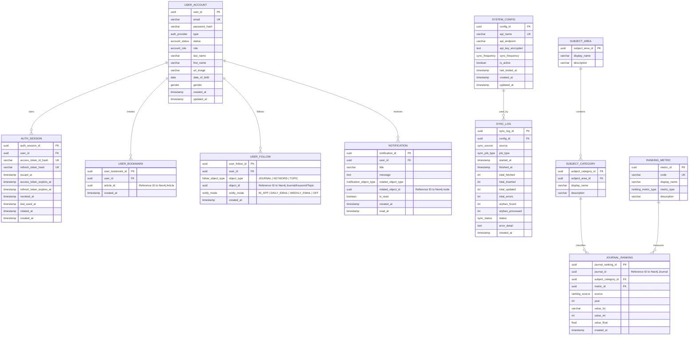
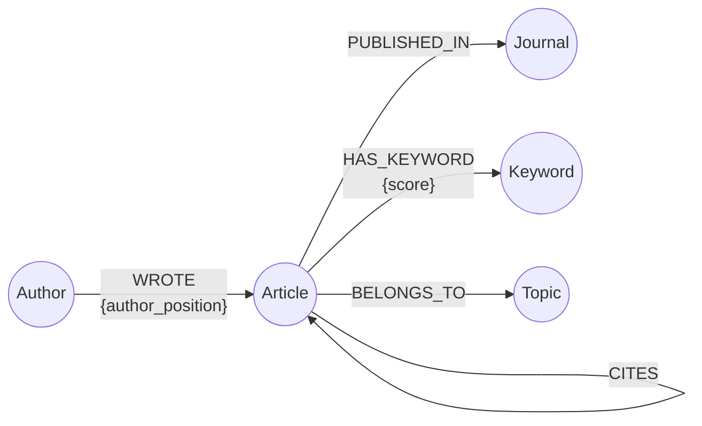
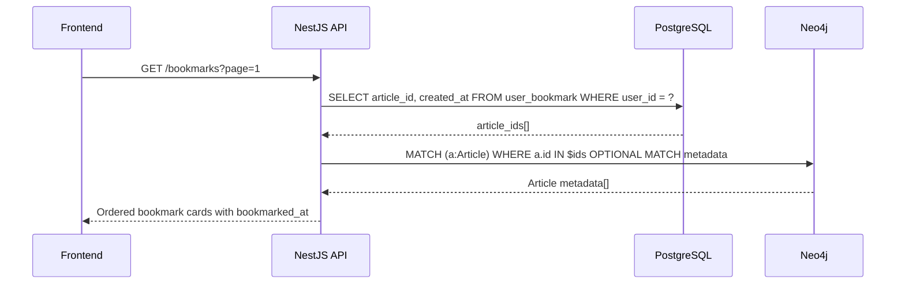
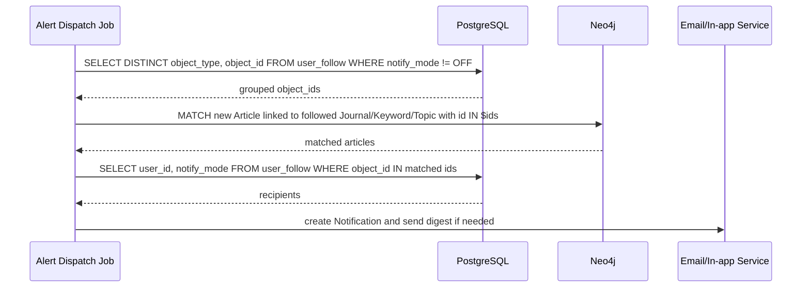
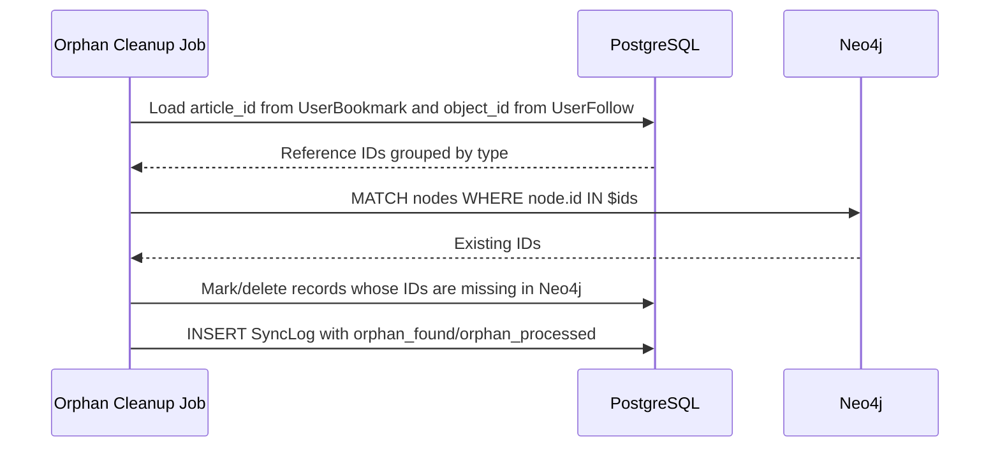

# SciLab ERD & Model Specification

Tài liệu này được xây dựng từ `docs/SRS/SRS.md` phiên bản 2.0. SciLab sử dụng mô hình **Polyglot Persistence**:

- **PostgreSQL** lưu dữ liệu giao dịch và vận hành: người dùng, phiên đăng nhập, bookmark, follow, thông báo, cấu hình nguồn dữ liệu, xếp hạng tạp chí, log đồng bộ.
- **Neo4j** lưu dữ liệu học thuật dạng mạng lưới: bài báo, tác giả, từ khóa, tạp chí, chủ đề và các quan hệ giữa chúng.

Nguyên tắc quan trọng: **Neo4j là nguồn dữ liệu chính cho metadata học thuật**. PostgreSQL không lưu bản sao `title`, `abstract`, `author name`, `keyword`, `journal name`... mà chỉ lưu **Reference ID** khi cần liên kết nghiệp vụ tới node trong Neo4j.

> Ghi chú với schema hiện tại: `services/api/prisma/schema.prisma` vẫn còn một số bảng học thuật kiểu RDBMS như `article`, `author`, `journal`, `keyword`, `topic`. Theo SRS v2, các bảng này cần được chuyển sang Neo4j; PostgreSQL chỉ giữ lại các bảng nghiệp vụ/danh mục/log như bên dưới.

---

## 1. Tổng quan model

### 1.1 Nhóm PostgreSQL

| Nhóm | Model | Vai trò |
|---|---|---|
| Identity & Access | `User_Account`, `AuthSession` | Tài khoản, hồ sơ, vai trò, phiên JWT/refresh token |
| User Activity | `UserBookmark`, `UserFollow`, `Notification` | Bookmark bài báo, theo dõi journal/keyword/topic, nhận thông báo |
| Configuration & Operations | `SystemConfig`, `SyncLog` | Cấu hình API nguồn, log đồng bộ và đối soát orphan reference |
| Ranking & Taxonomy | `JournalRanking`, `RankingMetric`, `SubjectArea`, `SubjectCategory` | Dữ liệu xếp hạng SCImago/Scopus/WoS/DOAJ và danh mục tra cứu |

### 1.2 Nhóm Neo4j

| Nhóm | Node / Relationship | Vai trò |
|---|---|---|
| Academic Nodes | `Article`, `Author`, `Journal`, `Keyword`, `Topic` | Metadata học thuật và thực thể chính để tìm kiếm/phân tích |
| Academic Edges | `WROTE`, `HAS_KEYWORD`, `PUBLISHED_IN`, `BELONGS_TO`, `CITES` | Mạng lưới quan hệ phục vụ search, trend, recommendation, knowledge graph |

---

## 2. PostgreSQL ERD



### 2.1 Quan hệ PostgreSQL

| Quan hệ | Cardinality | Ghi chú |
|---|---:|---|
| `User_Account` - `AuthSession` | 1 - N | Một người dùng có nhiều phiên đăng nhập. Xóa user thì xóa session. |
| `User_Account` - `UserBookmark` | 1 - N | Một user bookmark nhiều bài báo. `article_id` là Reference ID sang Neo4j, không phải FK PostgreSQL. |
| `User_Account` - `UserFollow` | 1 - N | Một user theo dõi nhiều Journal/Keyword/Topic. `object_id` là Reference ID sang Neo4j. |
| `User_Account` - `Notification` | 1 - N | Một user nhận nhiều thông báo. |
| `SystemConfig` - `SyncLog` | 1 - N | Một cấu hình nguồn dữ liệu có thể được nhiều job đồng bộ/log sử dụng. |
| `SubjectArea` - `SubjectCategory` | 1 - N | Lĩnh vực lớn chứa nhiều danh mục nhỏ. |
| `SubjectCategory` - `JournalRanking` | 1 - N | Một danh mục có nhiều bản ghi xếp hạng theo journal/năm/metric. |
| `RankingMetric` - `JournalRanking` | 1 - N | Một metric như SJR/H-Index có nhiều giá trị theo journal/năm. |

### 2.2 Reference ID không có FK database

Các cột sau **không tạo foreign key ở PostgreSQL**, vì thực thể đích nằm trong Neo4j:

| Bảng | Cột | Trỏ tới |
|---|---|---|
| `UserBookmark` | `article_id` | `(:Article { id })` |
| `UserFollow` | `object_id` | `(:Journal { id })`, `(:Keyword { id })`, hoặc `(:Topic { id })` tùy `object_type` |
| `Notification` | `related_object_id` | Node liên quan trong Neo4j |
| `JournalRanking` | `journal_id` | `(:Journal { id })` |

Tính toàn vẹn của các Reference ID này được đảm bảo ở tầng ứng dụng bằng batch query Neo4j `WHERE node.id IN $ids` và job đối soát orphan reference định kỳ.

---

## 3. Neo4j graph model



### 3.1 Graph cardinality

| Relationship | Cardinality nghiệp vụ | Ý nghĩa |
|---|---|---|
| `(Author)-[:WROTE]->(Article)` | N - N | Một tác giả viết nhiều bài; một bài có nhiều tác giả. |
| `(Article)-[:HAS_KEYWORD]->(Keyword)` | N - N | Một bài có nhiều keyword; một keyword xuất hiện ở nhiều bài. |
| `(Article)-[:PUBLISHED_IN]->(Journal)` | N - 1 | Một bài công bố ở một journal chính; một journal có nhiều bài. |
| `(Article)-[:BELONGS_TO]->(Topic)` | N - N | Một bài có thể thuộc nhiều chủ đề; một chủ đề có nhiều bài. |
| `(Article)-[:CITES]->(Article)` | N - N self-reference | Một bài trích dẫn nhiều bài khác và có thể được nhiều bài trích dẫn. |

---

## 4. Chi tiết model PostgreSQL

### 4.1 `User_Account`

Lưu thông tin tài khoản, hồ sơ và phân quyền người dùng.

| Field | Type | Constraint | Mô tả |
|---|---|---|---|
| `user_id` | `uuid` | PK | Định danh người dùng. |
| `email` | `varchar(255)` | NN, UK | Email đăng nhập, duy nhất trong hệ thống. |
| `password_hash` | `varchar(255)` | NN với provider `EMAIL` | Mật khẩu đã hash. Theo SRS dùng bcrypt work factor >= 12; code hiện tại có thể dùng Argon2. |
| `type` | `auth_provider` | NN | `EMAIL` hoặc `GOOGLE`. |
| `status` | `account_status` | NN | Trạng thái tài khoản. |
| `role` | `account_role` | NN | Vai trò truy cập: `STUDENT`, `RESEARCHER`, `ADMIN`. |
| `last_name` | `varchar(255)` | nullable | Họ. |
| `first_name` | `varchar(255)` | nullable | Tên. |
| `url_image` | `varchar(2048)` | nullable | URL ảnh đại diện. |
| `date_of_birth` | `date` | nullable | Ngày sinh. |
| `gender` | `gender` | nullable | Giới tính người dùng: `MALE`, `FEMALE`, `OTHER`. |
| `created_at` | `timestamp` | NN | Thời điểm tạo. |
| `updated_at` | `timestamp` | NN | Thời điểm cập nhật cuối. |

Index/unique:

- `UNIQUE(email)`
- Index đề xuất: `(role)`, `(status)`, `(created_at)` cho màn hình Admin User Management.

Quy tắc nghiệp vụ:

- Email phải đúng định dạng và duy nhất.
- Mật khẩu tối thiểu 8 ký tự, gồm chữ và số.
- User đăng ký mới mặc định là `STUDENT`.
- Admin mới được đổi vai trò hoặc vô hiệu hóa tài khoản.

### 4.2 `AuthSession`

Lưu phiên đăng nhập và refresh token đã hash để hỗ trợ JWT access token 1 giờ, refresh token 7 ngày.

| Field | Type | Constraint | Mô tả |
|---|---|---|---|
| `auth_session_id` | `uuid` | PK | Định danh session. |
| `user_id` | `uuid` | FK -> `User_Account.user_id`, NN | Chủ sở hữu session. |
| `access_token_id_hash` | `varchar(128)` | NN, UK | Hash định danh access token. |
| `refresh_token_hash` | `varchar(128)` | NN, UK | Hash refresh token. |
| `issued_at` | `timestamp` | NN | Thời điểm phát hành. |
| `access_token_expires_at` | `timestamp` | NN | Thời điểm access token hết hạn. |
| `refresh_token_expires_at` | `timestamp` | NN | Thời điểm refresh token hết hạn. |
| `revoked_at` | `timestamp` | nullable | Thời điểm logout/revoke. |
| `last_used_at` | `timestamp` | nullable | Lần sử dụng gần nhất. |
| `rotated_at` | `timestamp` | nullable | Thời điểm token được rotate. |
| `created_at` | `timestamp` | NN | Thời điểm tạo session. |

Index/unique:

- `UNIQUE(access_token_id_hash)`
- `UNIQUE(refresh_token_hash)`
- `INDEX(user_id)`
- `INDEX(access_token_expires_at)`
- `INDEX(refresh_token_expires_at)`

### 4.3 `UserBookmark`

Lưu hành vi bookmark bài báo của người dùng. Bảng này chỉ lưu Reference ID, không lưu metadata bài báo.

| Field | Type | Constraint | Mô tả |
|---|---|---|---|
| `user_bookmark_id` | `uuid` | PK | Định danh bookmark. |
| `user_id` | `uuid` | FK -> `User_Account.user_id`, NN | Người bookmark. |
| `article_id` | `uuid` | NN, Reference ID | Trỏ tới `(:Article { id })` trong Neo4j. Không phải FK PostgreSQL. |
| `created_at` | `timestamp` | NN | Thời điểm bookmark. |

Index/unique:

- `UNIQUE(user_id, article_id)`
- `INDEX(user_id, created_at DESC)` để phân trang danh sách bookmark.
- `INDEX(article_id)` để đối soát orphan reference.

Luồng đọc chuẩn:

1. PostgreSQL lấy `article_id` theo `user_id`, phân trang và sắp xếp theo `created_at`.
2. Neo4j nhận toàn bộ danh sách ID trong một query `WHERE a.id IN $ids`.
3. Backend map metadata theo đúng thứ tự bookmark.

### 4.4 `UserFollow`

Lưu đối tượng mà người dùng theo dõi: journal, keyword hoặc topic.

| Field | Type | Constraint | Mô tả |
|---|---|---|---|
| `user_follow_id` | `uuid` | PK | Định danh follow. |
| `user_id` | `uuid` | FK -> `User_Account.user_id`, NN | Người theo dõi. |
| `object_type` | `follow_object_type` | NN | `JOURNAL`, `KEYWORD`, `TOPIC`. |
| `object_id` | `uuid` | NN, Reference ID | Trỏ tới node Neo4j tương ứng với `object_type`. |
| `notify_mode` | `notify_mode` | NN | `IN_APP`, `DAILY_EMAIL`, `WEEKLY_EMAIL`, `OFF`. |
| `created_at` | `timestamp` | NN | Thời điểm bắt đầu follow. |

Index/unique:

- `UNIQUE(user_id, object_type, object_id)`
- `INDEX(user_id, created_at DESC)` cho trang profile.
- `INDEX(object_type, object_id)` cho Alert Dispatch Service.

Quy tắc nghiệp vụ:

- Follow/unfollow là thao tác toggle hoặc xóa record tương ứng.
- Khi gửi alert, service nhóm `object_id` theo `object_type`, query Neo4j theo batch, sau đó quay lại PostgreSQL tìm danh sách user cần nhận thông báo.

### 4.5 `Notification`

Lưu thông báo in-app và thông báo liên quan tới digest email.

| Field | Type | Constraint | Mô tả |
|---|---|---|---|
| `notification_id` | `uuid` | PK | Định danh thông báo. |
| `user_id` | `uuid` | FK -> `User_Account.user_id`, NN | Người nhận. |
| `title` | `varchar(255)` | NN | Tiêu đề thông báo. |
| `message` | `text` | NN | Nội dung thông báo. |
| `related_object_type` | `notification_object_type` | nullable | Loại node liên quan: `ARTICLE`, `JOURNAL`, `KEYWORD`, `TOPIC` nếu cần mở rộng. |
| `related_object_id` | `uuid` | nullable, Reference ID | Node Neo4j liên quan. |
| `is_read` | `boolean` | NN, default `false` | Đã đọc hay chưa. |
| `created_at` | `timestamp` | NN | Thời điểm tạo. |
| `read_at` | `timestamp` | nullable | Thời điểm đọc. |

Index đề xuất:

- `INDEX(user_id, is_read, created_at DESC)`
- `INDEX(related_object_type, related_object_id)`

### 4.6 `SystemConfig`

Lưu cấu hình nguồn dữ liệu ngoại vi cho Admin Data Sources.

| Field | Type | Constraint | Mô tả |
|---|---|---|---|
| `config_id` | `uuid` | PK | Định danh cấu hình. |
| `api_name` | `varchar(100)` | NN, UK | Tên nguồn: OpenAlex, Semantic Scholar, Crossref, SCImago. |
| `api_endpoint` | `varchar(2048)` | NN | URL endpoint. |
| `api_key_encrypted` | `text` | nullable | API key đã mã hóa at rest. |
| `sync_frequency` | `sync_frequency` | NN | `DAILY`, `WEEKLY`, hoặc tùy lịch mở rộng. |
| `is_active` | `boolean` | NN | Bật/tắt nguồn dữ liệu. |
| `last_tested_at` | `timestamp` | nullable | Lần test connection gần nhất. |
| `created_at` | `timestamp` | NN | Thời điểm tạo. |
| `updated_at` | `timestamp` | NN | Thời điểm cập nhật. |

Index/unique:

- `UNIQUE(api_name)`
- `INDEX(is_active)`

### 4.7 `SyncLog`

Ghi log cho scheduled sync, manual sync, trend aggregation và orphan cleanup.

| Field | Type | Constraint | Mô tả |
|---|---|---|---|
| `sync_log_id` | `uuid` | PK | Định danh log. |
| `config_id` | `uuid` | FK -> `SystemConfig.config_id`, NN | Cấu hình nguồn dữ liệu được job/log sử dụng. |
| `source` | `sync_source` | NN | `OPENALEX`, `SEMANTIC_SCHOLAR`, `CROSSREF`, `SCIMAGO`, `NEO4J`, `SYSTEM`. |
| `job_type` | `sync_job_type` | NN | `SCHEDULED_SYNC`, `MANUAL_SYNC`, `ORPHAN_CLEANUP`, `TREND_AGGREGATION`, `ALERT_DISPATCH`. |
| `started_at` | `timestamp` | NN | Thời điểm bắt đầu. |
| `finished_at` | `timestamp` | nullable | Thời điểm kết thúc. |
| `total_fetched` | `int` | default `0` | Số bản ghi lấy từ nguồn ngoài. |
| `total_inserted` | `int` | default `0` | Số node/record thêm mới. |
| `total_updated` | `int` | default `0` | Số node/record cập nhật. |
| `total_errors` | `int` | default `0` | Số lỗi phát sinh. |
| `orphan_found` | `int` | default `0` | Số Reference ID mồ côi phát hiện. |
| `orphan_processed` | `int` | default `0` | Số Reference ID mồ côi đã xử lý. |
| `status` | `sync_status` | NN | `SUCCESS`, `FAILED`, `PARTIAL`, `RUNNING`. |
| `error_detail` | `text` | nullable | Chi tiết lỗi. |
| `created_at` | `timestamp` | NN | Thời điểm ghi log. |

Index đề xuất:

- `INDEX(source, started_at DESC)`
- `INDEX(config_id, started_at DESC)`
- `INDEX(job_type, started_at DESC)`
- `INDEX(status, started_at DESC)`

### 4.8 `JournalRanking`

Lưu lịch sử xếp hạng journal theo năm và metric. Journal metadata vẫn nằm ở Neo4j.

| Field | Type | Constraint | Mô tả |
|---|---|---|---|
| `journal_ranking_id` | `uuid` | PK | Định danh bản ghi ranking. |
| `journal_id` | `uuid` | NN, Reference ID | Trỏ tới `(:Journal { id })` trong Neo4j. Không phải FK PostgreSQL. |
| `subject_category_id` | `uuid` | FK -> `SubjectCategory.subject_category_id`, nullable | Danh mục chuyên ngành áp dụng. |
| `metric_id` | `uuid` | FK -> `RankingMetric.metric_id`, NN | Metric được đo. |
| `source` | `ranking_source` | NN | Nguồn xếp hạng. |
| `year` | `int` | NN | Năm xếp hạng. |
| `value_txt` | `varchar(255)` | nullable | Giá trị dạng text, ví dụ `Q1`. |
| `value_int` | `int` | nullable | Giá trị dạng số nguyên, ví dụ h-index. |
| `value_float` | `float` | nullable | Giá trị dạng số thực, ví dụ SJR score. |
| `created_at` | `timestamp` | NN | Thời điểm import. |

Index/unique:

- `UNIQUE(journal_id, subject_category_id, source, metric_id, year)`
- `INDEX(journal_id, year DESC)`
- `INDEX(metric_id)`
- `INDEX(subject_category_id)`
- `INDEX(source, year)`

### 4.9 `RankingMetric`

Danh mục metric xếp hạng.

| Field | Type | Constraint | Mô tả |
|---|---|---|---|
| `metric_id` | `uuid` | PK | Định danh metric. |
| `code` | `varchar(100)` | UK | Mã metric: `SJR`, `H_INDEX`, `CITESCORE`, `IMPACT_FACTOR`, `QUARTILE`. |
| `display_name` | `varchar(255)` | nullable | Tên hiển thị. |
| `metric_type` | `ranking_metric_type` | NN | `QUARTILE`, `RANK`, `SCORE`, `PERCENTILE`. |
| `description` | `varchar(1000)` | nullable | Mô tả. |

### 4.10 `SubjectArea`

Danh mục lĩnh vực lớn.

| Field | Type | Constraint | Mô tả |
|---|---|---|---|
| `subject_area_id` | `uuid` | PK | Định danh lĩnh vực. |
| `display_name` | `varchar(255)` | NN | Tên lĩnh vực, ví dụ `Computer Science`. |
| `description` | `varchar(1000)` | nullable | Mô tả. |

Index/unique đề xuất:

- `UNIQUE(display_name)`

### 4.11 `SubjectCategory`

Danh mục chuyên ngành chi tiết nằm trong một `SubjectArea`.

| Field | Type | Constraint | Mô tả |
|---|---|---|---|
| `subject_category_id` | `uuid` | PK | Định danh danh mục. |
| `subject_area_id` | `uuid` | FK -> `SubjectArea.subject_area_id`, nullable | Lĩnh vực cha. |
| `display_name` | `varchar(255)` | NN | Tên danh mục. |
| `description` | `varchar(1000)` | nullable | Mô tả. |

Index/unique đề xuất:

- `INDEX(subject_area_id)`
- `UNIQUE(subject_area_id, display_name)`

---

## 5. Chi tiết model Neo4j

### 5.1 `Article` node

Bài báo nghiên cứu. Đây là node trung tâm cho search, trend analysis, recommendation và knowledge graph.

| Property | Type | Constraint | Mô tả |
|---|---|---|---|
| `id` | `uuid/string` | Unique, required | Reference ID dùng bởi PostgreSQL. |
| `title` | `string` | required | Tiêu đề bài báo. |
| `abstract` | `string` | nullable | Tóm tắt. |
| `doi` | `string` | unique nếu có | DOI, dùng để deduplicate. |
| `publication_year` | `int` | nullable | Năm công bố. |
| `version` | `string` | nullable | Phiên bản metadata. |
| `volume_number` | `int/string` | nullable | Số volume, gộp từ bảng `Volume` cũ. |
| `issue_number` | `string` | nullable | Số issue, gộp từ bảng `Issue` cũ. |
| `created_at` | `datetime` | required | Thời điểm đồng bộ/tạo. |
| `updated_at` | `datetime` | nullable | Thời điểm cập nhật metadata gần nhất. |

Constraint/index:

```cypher
CREATE CONSTRAINT article_id_unique IF NOT EXISTS
FOR (a:Article) REQUIRE a.id IS UNIQUE;

CREATE INDEX article_doi_index IF NOT EXISTS
FOR (a:Article) ON (a.doi);

CREATE INDEX article_publication_year_index IF NOT EXISTS
FOR (a:Article) ON (a.publication_year);
```

### 5.2 `Author` node

Tác giả bài báo.

| Property | Type | Constraint | Mô tả |
|---|---|---|---|
| `id` | `uuid/string` | Unique, required | Định danh author. |
| `orcid` | `string` | unique nếu có | ORCID. |
| `display_name` | `string` | nullable | Tên hiển thị. |
| `url_image` | `string` | nullable | Ảnh đại diện/hồ sơ nếu nguồn có. |

Constraint/index:

```cypher
CREATE CONSTRAINT author_id_unique IF NOT EXISTS
FOR (a:Author) REQUIRE a.id IS UNIQUE;

CREATE INDEX author_orcid_index IF NOT EXISTS
FOR (a:Author) ON (a.orcid);

CREATE TEXT INDEX author_display_name_text IF NOT EXISTS
FOR (a:Author) ON (a.display_name);
```

### 5.3 `Journal` node

Tạp chí học thuật. Metadata journal nằm ở Neo4j; ranking lịch sử nằm ở PostgreSQL qua `JournalRanking.journal_id`.

| Property | Type | Constraint | Mô tả |
|---|---|---|---|
| `id` | `uuid/string` | Unique, required | Reference ID dùng bởi `JournalRanking` và `UserFollow`. |
| `source_id` | `string` | nullable | ID từ OpenAlex/Crossref/SCImago. |
| `display_name` | `string` | nullable | Tên tạp chí. |
| `type` | `string` | nullable | Loại nguồn/tạp chí. |
| `is_open_access` | `boolean` | nullable | Trạng thái open access. |
| `is_oa_diamond` | `boolean` | nullable | Trạng thái OA diamond. |
| `coverage` | `string` | nullable | Phạm vi coverage. |
| `country` | `string` | nullable | Quốc gia hiển thị hoặc mã chuẩn. |
| `region` | `string` | nullable | Khu vực hiển thị hoặc mã chuẩn. |
| `issn_list` | `list<string>` | nullable | Danh sách ISSN, gộp từ `Journal_ISSN` cũ. |
| `publisher_name` | `string` | nullable | Tên publisher, gộp từ `Publisher` cũ. |
| `publisher_image_url` | `string` | nullable | Ảnh publisher nếu có. |
| `subject_categories` | `list<string>` | nullable | Danh mục chủ đề hiển thị/lọc. |

Constraint/index:

```cypher
CREATE CONSTRAINT journal_id_unique IF NOT EXISTS
FOR (j:Journal) REQUIRE j.id IS UNIQUE;

CREATE INDEX journal_source_id_index IF NOT EXISTS
FOR (j:Journal) ON (j.source_id);

CREATE TEXT INDEX journal_display_name_text IF NOT EXISTS
FOR (j:Journal) ON (j.display_name);
```

### 5.4 `Keyword` node

Từ khóa học thuật.

| Property | Type | Constraint | Mô tả |
|---|---|---|---|
| `id` | `uuid/string` | Unique, required | Reference ID dùng bởi `UserFollow`. |
| `display_name` | `string` | Unique đề xuất | Tên keyword. |

Constraint/index:

```cypher
CREATE CONSTRAINT keyword_id_unique IF NOT EXISTS
FOR (k:Keyword) REQUIRE k.id IS UNIQUE;

CREATE TEXT INDEX keyword_display_name_text IF NOT EXISTS
FOR (k:Keyword) ON (k.display_name);
```

### 5.5 `Topic` node

Chủ đề nghiên cứu cấp cao.

| Property | Type | Constraint | Mô tả |
|---|---|---|---|
| `id` | `uuid/string` | Unique, required | Reference ID dùng bởi `UserFollow`. |
| `display_name` | `string` | nullable | Tên topic. |
| `score` | `float` | nullable | Điểm liên quan/độ tin cậy từ nguồn phân loại. |

Constraint/index:

```cypher
CREATE CONSTRAINT topic_id_unique IF NOT EXISTS
FOR (t:Topic) REQUIRE t.id IS UNIQUE;

CREATE TEXT INDEX topic_display_name_text IF NOT EXISTS
FOR (t:Topic) ON (t.display_name);
```

### 5.6 `WROTE` relationship

```text
(Author)-[:WROTE]->(Article)
```

| Property | Type | Mô tả |
|---|---|---|
| `author_position` | `int` | Thứ tự tác giả trong bài báo. |

Thay thế bảng `Author_Article` trong thiết kế RDBMS cũ.

### 5.7 `HAS_KEYWORD` relationship

```text
(Article)-[:HAS_KEYWORD]->(Keyword)
```

| Property | Type | Mô tả |
|---|---|---|
| `score` | `float` | Mức độ liên quan của keyword với article. |

Thay thế bảng `Keyword_Article`; trường `score` được chuyển thành property của relationship.

### 5.8 `PUBLISHED_IN` relationship

```text
(Article)-[:PUBLISHED_IN]->(Journal)
```

Không cần property bắt buộc. Relationship này phục vụ:

- Trang chi tiết article.
- Trang chi tiết journal.
- Trend số lượng bài theo journal/năm.
- Follow journal và alert bài mới.

### 5.9 `BELONGS_TO` relationship

```text
(Article)-[:BELONGS_TO]->(Topic)
```

Thay thế `Article.primary_topic` và `Sub_Topic` trong thiết kế cũ. Nếu cần phân biệt topic chính/phụ, có thể thêm property:

| Property | Type | Mô tả |
|---|---|---|
| `is_primary` | `boolean` | Topic chính của article. |
| `score` | `float` | Mức độ liên quan article-topic. |

### 5.10 `CITES` relationship

```text
(Article)-[:CITES]->(Article)
```

Relationship tự tham chiếu dùng cho:

- Knowledge Graph Visualization.
- Recommendation dựa trên citation network.
- Advanced graph search.

---

## 6. Enum đề xuất

### 6.1 PostgreSQL enums

| Enum | Values | Ghi chú |
|---|---|---|
| `auth_provider` | `EMAIL`, `GOOGLE` | Nguồn xác thực. |
| `account_status` | `ACTIVE`, `INACTIVE`, `BANNED` | Trạng thái tài khoản. |
| `account_role` | `STUDENT`, `RESEARCHER`, `ADMIN` | User tự đăng ký luôn là `STUDENT`; `ADMIN` không được tạo qua register. |
| `gender` | `MALE`, `FEMALE`, `OTHER` | Giới tính trong `User_Account.gender`. |
| `follow_object_type` | `JOURNAL`, `KEYWORD`, `TOPIC` | Enum riêng của `UserFollow.object_type`. |
| `notify_mode` | `IN_APP`, `DAILY_EMAIL`, `WEEKLY_EMAIL`, `OFF` | Cấu hình thông báo trong `UserFollow.notify_mode`. |
| `notification_object_type` | `ARTICLE`, `JOURNAL`, `KEYWORD`, `TOPIC` | Loại node liên quan cho `Notification.related_object_type`. |
| `sync_frequency` | `DAILY`, `WEEKLY` | Có thể mở rộng `MANUAL`, `CRON`. |
| `sync_source` | `OPENALEX`, `SEMANTIC_SCHOLAR`, `CROSSREF`, `SCIMAGO`, `NEO4J`, `SYSTEM` | Nguồn job/log. |
| `sync_job_type` | `SCHEDULED_SYNC`, `MANUAL_SYNC`, `ORPHAN_CLEANUP`, `TREND_AGGREGATION`, `ALERT_DISPATCH` | Loại job nền. |
| `sync_status` | `RUNNING`, `SUCCESS`, `FAILED`, `PARTIAL` | Trạng thái job. |
| `ranking_source` | `SCIMAGO`, `SCOPUS`, `WOS`, `DOAJ`, `OTHER` | Nguồn ranking. |
| `ranking_metric_type` | `QUARTILE`, `RANK`, `SCORE`, `PERCENTILE` | Kiểu metric. |

---

## 7. Cross-database read/write patterns

### 7.1 Bookmark list



### 7.2 Follow alert dispatch



### 7.3 Orphan reference cleanup



---

## 8. Mapping từ schema RDBMS cũ sang mô hình mới

| Schema cũ / hiện tại | Mô hình theo SRS v2 | Ghi chú |
|---|---|---|
| `publisher` | Property của `(:Journal)` | `publisher_name`, `publisher_image_url`. |
| `journal` | `(:Journal)` | PostgreSQL chỉ giữ `journal_id` dạng Reference ID ở `JournalRanking`/`UserFollow`. |
| `journal_issn` | Property `issn_list` của `(:Journal)` | Không cần bảng riêng. |
| `volume` | Property `volume_number` của `(:Article)` | Không cần bảng riêng. |
| `issue` | Property `issue_number` của `(:Article)` | Không cần bảng riêng. |
| `article` | `(:Article)` | `doi` là khóa dedup chính. |
| `author` | `(:Author)` | `orcid` là định danh phụ nếu có. |
| `author_article` | `(:Author)-[:WROTE]->(:Article)` | `author_position` là relationship property. |
| `keyword` | `(:Keyword)` | Search/trend truy vấn bằng Cypher. |
| `keyword_article` | `(:Article)-[:HAS_KEYWORD]->(:Keyword)` | `score` là relationship property. |
| `topic` | `(:Topic)` | Topic có thể dùng cho trend/follow/advanced search. |
| `sub_topic` | `(:Article)-[:BELONGS_TO]->(:Topic)` | Có thể thêm `is_primary`/`score` trên relationship. |
| `journal_subject_category` | Property `subject_categories` của `(:Journal)` hoặc relationship graph mở rộng nếu cần | SRS đề xuất gộp property; bảng danh mục gốc vẫn ở PostgreSQL. |
| `ranking_metric` | Giữ PostgreSQL | Danh mục metric. |
| `journal_ranking` | Giữ PostgreSQL nhưng `journal_id` là Reference ID | Không FK tới bảng `journal`. |
| `subject_area`, `subject_category` | Giữ PostgreSQL | Danh mục/taxonomy phục vụ lọc và ranking trong MVP. |
| `auth_session` | Giữ PostgreSQL | Phục vụ JWT/refresh token. |
| `user_bookmark`, `user_follow`, `notification`, `sync_log`, `system_config` | Bổ sung PostgreSQL | Các bảng nghiệp vụ/vận hành theo SRS. |

---

## 9. Ràng buộc thiết kế quan trọng

1. PostgreSQL không lưu duplicate metadata học thuật. Mọi title/abstract/author/journal/keyword/topic nằm ở Neo4j.
2. Mọi truy vấn kết hợp PostgreSQL + Neo4j phải dùng batch query theo `IN $ids`, không truy vấn N+1 từng ID.
3. `UserBookmark.article_id`, `UserFollow.object_id`, `Notification.related_object_id`, `JournalRanking.journal_id` là Reference ID, không phải FK database.
4. `UserBookmark` phải có `UNIQUE(user_id, article_id)`.
5. `UserFollow` phải có `UNIQUE(user_id, object_type, object_id)`.
6. `SyncLog.config_id` liên kết tới `SystemConfig.config_id` để biết log/job thuộc cấu hình nguồn nào.
7. Orphan reference phải được phát hiện bằng cron job định kỳ và ghi lại trong `SyncLog`.
8. API phải parameterize toàn bộ Cypher query, đặc biệt các danh sách ID truyền vào `IN $ids`.
9. Neo4j cần unique constraint trên `id` cho mọi node label chính để đảm bảo tra cứu nhanh và ổn định.
10. Các chức năng graph như recommendation, knowledge graph visualization, advanced search phải truy vấn trực tiếp Neo4j.

---

## 10. Checklist triển khai schema

### PostgreSQL

- [ ] Thêm bảng `user_bookmark`.
- [ ] Thêm bảng `user_follow`.
- [ ] Thêm bảng `notification`.
- [ ] Thêm bảng `sync_log`.
- [ ] Thêm bảng `system_config`.
- [ ] Thêm FK `sync_log.config_id -> system_config.config_id`.
- [ ] Điều chỉnh `role_account` để hỗ trợ `STUDENT`, `RESEARCHER`, `ADMIN` cho MVP.
- [ ] Chuyển `journal_ranking.journal_id` thành Reference ID, không FK tới bảng `journal`.
- [ ] Loại bỏ hoặc ngừng dùng các bảng học thuật cũ trong PostgreSQL sau khi ETL sang Neo4j hoàn tất.

### Neo4j

- [ ] Tạo constraint unique cho `Article.id`, `Author.id`, `Journal.id`, `Keyword.id`, `Topic.id`.
- [ ] Tạo index cho `Article.doi`, `Article.publication_year`.
- [ ] Tạo text index cho `display_name` của `Author`, `Journal`, `Keyword`, `Topic`.
- [ ] ETL dữ liệu học thuật từ nguồn ngoài vào node/relationship Neo4j.
- [ ] Implement deduplication theo DOI, fallback `title + publication_year + journal`.
- [ ] Implement reconciliation job kiểm tra orphan reference giữa PostgreSQL và Neo4j.
