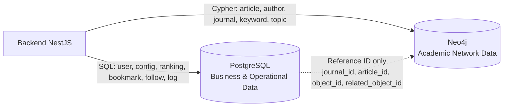
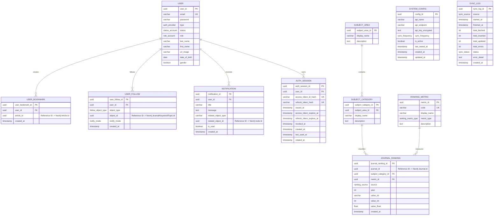
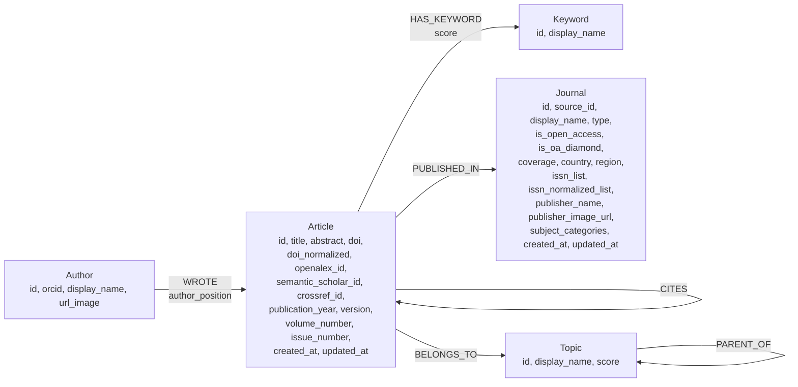

# ERD - SciLab

Tài liệu này được phân tích từ `docs/SRS/SRS.md` phiên bản 2.0. Thiết kế dữ liệu mục tiêu của SciLab dùng **polyglot persistence**:

- **PostgreSQL** lưu dữ liệu nghiệp vụ, giao dịch, cấu hình, log, bookmark/follow và danh mục tra cứu.
- **Neo4j** lưu metadata học thuật dạng graph: Article, Author, Journal, Keyword, Topic và các quan hệ giữa chúng.
- PostgreSQL **không lưu bản sao metadata học thuật** như title, abstract, author name, keyword name, journal name. Khi cần liên kết tới dữ liệu học thuật, PostgreSQL chỉ lưu **Reference ID** là UUID trùng với thuộc tính `id` của node Neo4j.

## 1. Tổng quan quan hệ dữ liệu



## 2. PostgreSQL ERD



## 3. Chi tiết bảng PostgreSQL

### 3.1 `User`

Lưu tài khoản, hồ sơ cơ bản và phân quyền.

| Field | Type | Key | Null | Ghi chú |
|---|---|---:|---:|---|
| `user_id` | uuid | PK | No | Khóa chính. |
| `email` | varchar(255) | UK | No | Email duy nhất, dùng đăng nhập. |
| `password` | varchar(255) |  | Conditional | Hash mật khẩu; bắt buộc với `type = EMAIL`, có thể rỗng/null với OAuth. |
| `type` | `auth_provider` |  | No | `EMAIL`, `GOOGLE`. |
| `status` | `status_account` |  | No | Trạng thái tài khoản. |
| `role` | `role_account` |  | No | Vai trò người dùng: `STUDENT`, `RESEARCHER`, `ADMIN`. |
| `last_name` | varchar(255) |  | Yes | Họ. |
| `first_name` | varchar(255) |  | Yes | Tên. |
| `url_image` | varchar(2048) |  | Yes | Ảnh đại diện. |
| `date_of_birth` | date |  | Yes | Ngày sinh. |
| `gender` | boolean |  | Yes | Giới tính theo thiết kế hiện tại; nếu cần nhiều giá trị hơn nên đổi enum. |

Ràng buộc:

- `UNIQUE(email)`
- Password tối thiểu 8 ký tự và gồm chữ + số theo business rule, kiểm tra ở tầng ứng dụng.

### 3.2 `Auth_Session`

Lưu phiên đăng nhập, hash token và thời hạn token để hỗ trợ refresh/thu hồi phiên.

| Field | Type | Key | Null | Ghi chú |
|---|---|---:|---:|---|
| `auth_session_id` | uuid | PK | No | Khóa chính. |
| `user_id` | uuid | FK | No | Người sở hữu phiên. |
| `access_token_id_hash` | varchar(128) | UK | No | Hash của access token id/jti, không lưu token thô. |
| `refresh_token_hash` | varchar(128) | UK | No | Hash refresh token, không lưu token thô. |
| `issued_at` | timestamp |  | No | Thời điểm phát hành token. |
| `access_token_expires_at` | timestamp |  | No | Thời điểm access token hết hạn. |
| `refresh_token_expires_at` | timestamp |  | No | Thời điểm refresh token hết hạn. |
| `revoked_at` | timestamp |  | Yes | Thời điểm thu hồi phiên khi logout/rotate bất thường. |
| `created_at` | timestamp |  | No | Thời điểm tạo bản ghi. |
| `last_used_at` | timestamp |  | Yes | Lần sử dụng gần nhất. |
| `rotated_at` | timestamp |  | Yes | Lần rotate refresh token gần nhất. |

Ràng buộc:

- FK: `user_id -> User.user_id`
- `UNIQUE(access_token_id_hash)`
- `UNIQUE(refresh_token_hash)`
- Index nên có: `(user_id)`, `(access_token_expires_at)`, `(refresh_token_expires_at)`

### 3.3 `System_Config`

Cấu hình nguồn API bên ngoài cho Admin quản lý.

| Field | Type | Key | Null | Ghi chú |
|---|---|---:|---:|---|
| `config_id` | uuid | PK | No | Khóa chính. |
| `api_name` | varchar(100) |  | No | Tên nguồn, mặc định là OpenAlex. |
| `api_endpoint` | varchar(2048) |  | No | Endpoint/API base URL. |
| `api_key_encrypted` | text |  | Yes | API key đã mã hóa at rest; nullable nếu dùng public access của OpenAlex. |
| `sync_frequency` | `sync_frequency` |  | No | `daily`, `weekly`. |
| `is_active` | boolean |  | No | Bật/tắt nguồn dữ liệu. |
| `last_tested_at` | timestamp |  | Yes | Lần test connection gần nhất. |
| `created_at` | timestamp |  | No | Thời điểm tạo. |
| `updated_at` | timestamp |  | No | Thời điểm cập nhật. |

Gợi ý ràng buộc:

- `UNIQUE(api_name)`
- `is_active DEFAULT true`
- `created_at DEFAULT now()`, `updated_at DEFAULT now()`

### 3.4 `Journal_Ranking`

Lưu chỉ số xếp hạng tạp chí theo năm. Metadata của tạp chí nằm ở Neo4j, bảng này chỉ giữ `journal_id` dạng Reference ID.

| Field | Type | Key | Null | Ghi chú |
|---|---|---:|---:|---|
| `journal_ranking_id` | uuid | PK | No | Khóa chính. |
| `journal_id` | uuid | REF | No | Reference ID tới `(:Journal {id})` trong Neo4j, không khai báo FK ở PostgreSQL. |
| `subject_category_id` | uuid | FK | Yes | FK tới `Subject_Category`. |
| `metric_id` | uuid | FK | No | FK tới `Ranking_Metric`. |
| `source` | `ranking_source` |  | No | `openalex`. |
| `year` | int |  | No | Năm xếp hạng. |
| `value_txt` | varchar(255) |  | Yes | Giá trị dạng text, ví dụ quartile `Q1`. |
| `value_int` | int |  | Yes | Giá trị số nguyên, ví dụ rank/h-index. |
| `value_float` | double precision |  | Yes | Giá trị thập phân, ví dụ SJR/CiteScore. |
| `created_at` | timestamp |  | No | Thời điểm import/tạo bản ghi. |

Ràng buộc:

- FK: `subject_category_id -> Subject_Category.subject_category_id`
- FK: `metric_id -> Ranking_Metric.metric_id`
- Không FK database cho `journal_id`
- Gợi ý unique: `(journal_id, subject_category_id, source, metric_id, year)`

### 3.5 `Ranking_Metric`

Danh mục loại chỉ số xếp hạng.

| Field | Type | Key | Null | Ghi chú |
|---|---|---:|---:|---|
| `metric_id` | uuid | PK | No | Khóa chính. |
| `code` | varchar(100) | UK | No | Mã chỉ số: `SJR`, `H_INDEX`, `CITESCORE`, `IMPACT_FACTOR`. |
| `display_name` | varchar(255) |  | No | Tên hiển thị. |
| `metric_type` | `ranking_metric_type` |  | No | `quartile`, `rank`, `score`, `percentile`. |
| `description` | text |  | Yes | Mô tả. |

Ràng buộc:

- `UNIQUE(code)`

### 3.6 `Subject_Area`

Danh mục lĩnh vực rộng, ví dụ Computer Science.

| Field | Type | Key | Null | Ghi chú |
|---|---|---:|---:|---|
| `subject_area_id` | uuid | PK | No | Khóa chính. |
| `display_name` | varchar(255) |  | No | Tên lĩnh vực. |
| `description` | text |  | Yes | Mô tả. |

### 3.7 `Subject_Category`

Danh mục chi tiết thuộc một subject area.

| Field | Type | Key | Null | Ghi chú |
|---|---|---:|---:|---|
| `subject_category_id` | uuid | PK | No | Khóa chính. |
| `subject_area_id` | uuid | FK | No | FK tới `Subject_Area`. |
| `display_name` | varchar(255) |  | No | Tên danh mục. |
| `description` | text |  | Yes | Mô tả. |

Ràng buộc:

- FK: `subject_area_id -> Subject_Area.subject_area_id`

### 3.8 `User_Bookmark`

Lưu bookmark bài báo của người dùng. Không lưu title/abstract/author/journal.

| Field | Type | Key | Null | Ghi chú |
|---|---|---:|---:|---|
| `user_bookmark_id` | uuid | PK | No | Khóa chính. |
| `user_id` | uuid | FK | No | Người bookmark. |
| `article_id` | uuid | REF | No | Reference ID tới `(:Article {id})` trong Neo4j. |
| `created_at` | timestamp |  | No | Thời điểm bookmark. |

Ràng buộc:

- FK: `user_id -> User.user_id`
- Không FK database cho `article_id`
- `UNIQUE(user_id, article_id)`
- Index nên có: `(user_id, created_at DESC)`, `(article_id)`

### 3.9 `User_Follow`

Lưu đối tượng người dùng theo dõi: Journal, Keyword hoặc Topic.

| Field | Type | Key | Null | Ghi chú |
|---|---|---:|---:|---|
| `user_follow_id` | uuid | PK | No | Khóa chính. |
| `user_id` | uuid | FK | No | Người theo dõi. |
| `object_type` | `follow_object_type` |  | No | `JOURNAL`, `KEYWORD`, `TOPIC`. |
| `object_id` | uuid | REF | No | Reference ID tới node Neo4j tương ứng với `object_type`. |
| `notify_mode` | `notify_mode` |  | No | `in_app`, `daily`, `weekly`, `off`. |
| `created_at` | timestamp |  | No | Thời điểm follow. |

Ràng buộc:

- FK: `user_id -> User.user_id`
- Không FK database cho `object_id`
- `UNIQUE(user_id, object_type, object_id)`
- Index nên có: `(object_type, object_id)`, `(user_id, created_at DESC)`

### 3.10 `Notification`

Lưu thông báo in-app/email cho người dùng.

| Field | Type | Key | Null | Ghi chú |
|---|---|---:|---:|---|
| `notification_id` | uuid | PK | No | Khóa chính. |
| `user_id` | uuid | FK | No | Người nhận thông báo. |
| `title` | varchar(255) |  | No | Tiêu đề thông báo. |
| `message` | text |  | No | Nội dung. |
| `related_object_type` | varchar(50) |  | Yes | Loại đối tượng liên quan: ARTICLE/JOURNAL/KEYWORD/TOPIC/SYSTEM... |
| `related_object_id` | uuid | REF | Yes | Reference ID tới node Neo4j hoặc đối tượng nghiệp vụ liên quan. |
| `is_read` | boolean |  | No | Đã đọc/chưa đọc. |
| `created_at` | timestamp |  | No | Thời điểm tạo. |

Ràng buộc:

- FK: `user_id -> User.user_id`
- Index nên có: `(user_id, is_read, created_at DESC)`

### 3.11 `Sync_Log`

Nhật ký chạy job đồng bộ và đối soát dữ liệu.

| Field | Type | Key | Null | Ghi chú |
|---|---|---:|---:|---|
| `sync_log_id` | uuid | PK | No | Khóa chính. |
| `source` | `sync_source` |  | No | `openalex` hoặc `orphan_cleanup`. |
| `started_at` | timestamp |  | No | Thời điểm bắt đầu. |
| `finished_at` | timestamp |  | Yes | Thời điểm kết thúc. |
| `total_fetched` | int |  | No | Số bản ghi lấy được. |
| `total_inserted` | int |  | No | Số bản ghi thêm mới. |
| `total_updated` | int |  | No | Số bản ghi cập nhật. |
| `total_errors` | int |  | No | Số lỗi. |
| `status` | `sync_status` |  | No | `success`, `failed`, `partial`. |
| `error_detail` | text |  | Yes | Chi tiết lỗi nếu có. |
| `created_at` | timestamp |  | No | Thời điểm tạo log. |

Index nên có:

- `(source, started_at DESC)`
- `(status, started_at DESC)`

## 4. Enum đề xuất

| Enum | Values | Ghi chú |
|---|---|---|
| `auth_provider` | `EMAIL`, `GOOGLE` | Nguồn xác thực. |
| `status_account` | `ACTIVE`, `INACTIVE`, `BANNED` | Có thể bổ sung `PENDING` nếu cần duyệt tài khoản. |
| `role_account` | `STUDENT`, `RESEARCHER`, `ADMIN` | Vai trò hệ thống. `STUDENT` là mặc định sau đăng ký. |
| `ranking_metric_type` | `QUARTILE`, `RANK`, `SCORE`, `PERCENTILE` | Kiểu chỉ số ranking. |
| `ranking_source` | `OPENALEX` | Nguồn metric/ranking trong phạm vi hiện tại. |
| `sync_frequency` | `DAILY`, `WEEKLY` | Tần suất đồng bộ cấu hình API. |
| `follow_object_type` | `JOURNAL`, `KEYWORD`, `TOPIC` | Loại node được follow tại Neo4j. |
| `notify_mode` | `IN_APP`, `DAILY`, `WEEKLY`, `OFF` | Chế độ nhận thông báo. |
| `sync_source` | `OPENALEX`, `ORPHAN_CLEANUP` | `ORPHAN_CLEANUP` dùng để log reconciliation job theo NFR-DC03. |
| `sync_status` | `SUCCESS`, `FAILED`, `PARTIAL` | Trạng thái job. |

## 5. Neo4j Graph Data Model

### 5.1 Graph overview



### 5.2 Node labels

#### `Article`

| Property | Type | Required | Ghi chú |
|---|---|---:|---|
| `id` | uuid | Yes | Unique; Reference ID dùng ở PostgreSQL. |
| `title` | string | Yes | Tiêu đề bài báo. |
| `abstract` | text | Yes/No | SRS cho phép metadata abstract; có thể null nếu nguồn không cung cấp. |
| `doi` | string | Yes/No | Dùng chống trùng; unique khi có giá trị. |
| `doi_normalized` | string | Yes/No | DOI đã chuẩn hóa để tìm kiếm/so khớp ổn định, ví dụ lower-case và bỏ prefix URL. |
| `openalex_id` | string | Yes/No | External ID của OpenAlex Work. |
| `semantic_scholar_id` | string | Yes/No | External ID từ Semantic Scholar nếu dữ liệu nguồn có cung cấp/đối chiếu được. |
| `crossref_id` | string | Yes/No | External ID từ Crossref nếu dữ liệu nguồn có cung cấp/đối chiếu được. |
| `publication_year` | int | Yes | Dùng phân tích xu hướng. |
| `version` | string | Yes/No | Phiên bản bài báo. |
| `volume_number` | int/string | Yes/No | Gộp từ thực thể Volume cũ. |
| `issue_number` | string | Yes/No | Gộp từ thực thể Issue cũ. |
| `created_at` | datetime | Yes | Thời điểm ghi vào graph. |
| `updated_at` | datetime | Yes/No | Thời điểm cập nhật metadata gần nhất. |

Constraint/index:

- `UNIQUE (:Article.id)`
- Index nên có: `Article(doi_normalized)`, `Article(openalex_id)`, `Article(semantic_scholar_id)`, `Article(crossref_id)`, `Article(publication_year)`, full-text index cho `title`, `abstract`.

#### `Author`

| Property | Type | Required | Ghi chú |
|---|---|---:|---|
| `id` | uuid | Yes | Unique. |
| `orcid` | string | Yes/No | Định danh ORCID, nên unique khi có. |
| `display_name` | string | Yes | Tên hiển thị. |
| `url_image` | string | Yes/No | Ảnh tác giả. |

Constraint/index:

- `UNIQUE (:Author.id)`
- Optional unique/index: `Author(orcid)`

#### `Keyword`

| Property | Type | Required | Ghi chú |
|---|---|---:|---|
| `id` | uuid | Yes | Unique. |
| `display_name` | string | Yes | Từ khóa học thuật. |

Constraint/index:

- `UNIQUE (:Keyword.id)`
- Index nên có: `Keyword(display_name)`

#### `Journal`

| Property | Type | Required | Ghi chú |
|---|---|---:|---|
| `id` | uuid | Yes | Unique; được `Journal_Ranking.journal_id`, `User_Follow.object_id` tham chiếu. |
| `source_id` | string | Yes/No | ID nguồn chính của journal/source. |
| `display_name` | string | Yes | Tên tạp chí. |
| `type` | string | Yes/No | Loại tạp chí/nguồn. |
| `is_open_access` | boolean | Yes/No | Trạng thái OA. |
| `is_oa_diamond` | boolean | Yes/No | Trạng thái OA diamond. |
| `coverage` | string | Yes/No | Phạm vi coverage. |
| `country` | string | Yes/No | Quốc gia. |
| `region` | string | Yes/No | Khu vực. |
| `issn_list` | string[] | Yes/No | Danh sách ISSN, thay thế bảng `Journal_ISSN` cũ. |
| `issn_normalized_list` | string[] | Yes/No | Danh sách ISSN đã chuẩn hóa để tìm kiếm/so khớp. |
| `publisher_name` | string | Yes/No | Tên publisher, thay thế bảng `Publisher` cũ. |
| `publisher_image_url` | string | Yes/No | Ảnh/logo publisher. |
| `subject_categories` | string[] | Yes/No | Tên danh mục; chi tiết tra cứu ở PostgreSQL `Subject_Category`. |
| `created_at` | datetime | Yes/No | Thời điểm ghi vào graph. |
| `updated_at` | datetime | Yes/No | Thời điểm cập nhật metadata gần nhất. |

Constraint/index:

- `UNIQUE (:Journal.id)`
- Index nên có: `Journal(source_id)`, `Journal(display_name)`, `Journal(country)`, `Journal(region)`, `Journal(issn_normalized_list)`

#### `Topic`

| Property | Type | Required | Ghi chú |
|---|---|---:|---|
| `id` | uuid | Yes | Unique. |
| `display_name` | string | Yes | Tên chủ đề. |
| `score` | float | Yes/No | Điểm liên quan/độ tin cậy từ nguồn phân loại. |

Constraint/index:

- `UNIQUE (:Topic.id)`
- Index nên có: `Topic(display_name)`
- Nếu nguồn dữ liệu có topic hierarchy, dùng relationship `(:Topic)-[:PARENT_OF]->(:Topic)` để nối Topic cha với Topic con.

### 5.3 Relationships

| Relationship | Direction | Properties | Cardinality | Ghi chú |
|---|---|---|---|---|
| `WROTE` | `(Author) -> (Article)` | `author_position int` | Author N - N Article | Thay bảng `Author_Article`. |
| `HAS_KEYWORD` | `(Article) -> (Keyword)` | `score double` | Article N - N Keyword | Thay bảng `Keyword_Article`. |
| `PUBLISHED_IN` | `(Article) -> (Journal)` | None | Journal 1 - N Article | Một article thuộc một journal chính. |
| `BELONGS_TO` | `(Article) -> (Topic)` | Optional metadata nếu có sub-topic | Article N - N Topic | Thay `Sub_Topic`; topic chính/phụ có thể phân biệt bằng property nếu cần. |
| `CITES` | `(Article) -> (Article)` | None | Article N - N Article | Phục vụ knowledge graph và recommendation. |
| `PARENT_OF` | `(Topic) -> (Topic)` | None | Topic 1 - N Topic | Tùy chọn, dùng cho phân cấp chủ đề khi dữ liệu có topic hierarchy. |

## 6. Reference ID và quy tắc toàn vẹn

Các field sau là **Reference ID**, không phải FK vật lý trong PostgreSQL:

| PostgreSQL field | Trỏ tới Neo4j | Cách kiểm tra |
|---|---|---|
| `Journal_Ranking.journal_id` | `(:Journal {id})` | Backend/ETL kiểm tra bằng batch Cypher. |
| `User_Bookmark.article_id` | `(:Article {id})` | Khi hiển thị bookmark, lấy danh sách ID từ PostgreSQL rồi query Neo4j bằng `IN`. |
| `User_Follow.object_id` | `(:Journal {id})`, `(:Keyword {id})`, hoặc `(:Topic {id})` | Dựa vào `object_type`. |
| `Notification.related_object_id` | Node liên quan hoặc object nghiệp vụ liên quan | Có thể null với thông báo hệ thống. |

Quy tắc bắt buộc từ SRS:

- Không lưu duplicate metadata học thuật trong PostgreSQL.
- Không truy vấn Neo4j kiểu N+1 theo từng ID. Phải batch query bằng `WHERE n.id IN $ids`.
- Mọi Cypher query phải parameterized để tránh Cypher injection.
- Phải có reconciliation/orphan cleanup job định kỳ quét `User_Bookmark` và `User_Follow`, kiểm tra ID còn tồn tại ở Neo4j hay không.

## 7. Luồng dữ liệu quan trọng

### 7.1 Bookmark list

1. PostgreSQL lấy `article_id` từ `User_Bookmark` theo `user_id`, phân trang và sắp xếp theo `created_at DESC`.
2. Backend gom toàn bộ `article_id` thành một batch.
3. Neo4j query một lần:

```cypher
MATCH (a:Article)
WHERE a.id IN $ids
OPTIONAL MATCH (a)<-[w:WROTE]-(au:Author)
OPTIONAL MATCH (a)-[:PUBLISHED_IN]->(j:Journal)
RETURN a, collect({author: au, position: w.author_position}) AS authors, j
```

4. Backend map kết quả Neo4j về đúng thứ tự bookmark và bổ sung `bookmarked_at`.

### 7.2 Follow notification

1. PostgreSQL lấy danh sách `object_id` đang được follow theo `object_type`.
2. Neo4j tìm article mới có quan hệ với các object đó:
   - Journal: `(:Article)-[:PUBLISHED_IN]->(:Journal)`
   - Keyword: `(:Article)-[:HAS_KEYWORD]->(:Keyword)`
   - Topic: `(:Article)-[:BELONGS_TO]->(:Topic)`
3. PostgreSQL truy ngược `User_Follow` theo `object_type + object_id` để lấy người nhận.
4. Tạo bản ghi `Notification` và gửi email nếu `notify_mode` yêu cầu.

### 7.3 Data synchronization

1. Scheduler gọi OpenAlex API theo lịch cấu hình.
2. ETL upsert node/edge học thuật vào Neo4j.
3. Metric theo năm từ OpenAlex được ghi vào PostgreSQL `Journal_Ranking`, dùng `journal_id` là Reference ID sang Neo4j.
4. Mỗi lần chạy ghi `Sync_Log`.

## 8. Bảng cũ được thay đổi theo SRS 2.0

| Thiết kế RDBMS cũ | Trạng thái trong SRS 2.0 |
|---|---|
| `Publisher` | Loại bảng riêng, gộp vào `Journal.publisher_name`, `Journal.publisher_image_url` ở Neo4j. |
| `Journal` | Chuyển thành node `Journal` trong Neo4j. |
| `Journal_ISSN` | Gộp vào `Journal.issn_list[]` ở Neo4j. |
| `Volume` | Gộp vào `Article.volume_number` ở Neo4j. |
| `Issue` | Gộp vào `Article.issue_number` ở Neo4j. |
| `Article` | Chuyển thành node `Article` trong Neo4j. |
| `Author` | Chuyển thành node `Author` trong Neo4j. |
| `Author_Article` | Loại bỏ, thay bằng relationship `WROTE`. |
| `Keyword` | Chuyển thành node `Keyword` trong Neo4j. |
| `Keyword_Article` | Loại bỏ, thay bằng relationship `HAS_KEYWORD`. |
| `Topic` | Chuyển thành node `Topic` trong Neo4j. |
| `Sub_Topic` | Gộp vào relationship/property của `BELONGS_TO` hoặc property mở rộng của `Topic`. |
| `Journal_Subject_Category` | Loại bỏ junction table; `Journal.subject_categories[]` ở Neo4j, danh mục gốc vẫn ở PostgreSQL `Subject_Category`. |
| `Ranking_Metric`, `Subject_Area`, `Subject_Category` | Giữ ở PostgreSQL. |
| `Journal_Ranking` | Giữ ở PostgreSQL nhưng `journal_id` là Reference ID sang Neo4j. |

## 9. Ghi chú triển khai

- ERD này là thiết kế mục tiêu theo SRS 2.0. Nếu Prisma schema hiện tại vẫn còn các bảng học thuật kiểu RDBMS (`journal`, `article`, `author`, `keyword`, `topic`...), cần migration theo bảng mapping ở mục 8.
- `Sync_Log.source` trong SRS chưa bao phủ orphan cleanup job, trong khi NFR-DC03 yêu cầu log reconciliation. Nên bổ sung `ORPHAN_CLEANUP` hoặc đổi thiết kế thành `job_type + source`.
