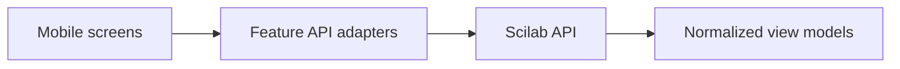

# Dữ liệu và Contract FE Mobile Cần

**Ngày cập nhật**: 2026-06-27

**Trạng thái**: Danh sách nhu cầu FE, chưa phải API contract chính thức

## 1. Ranh giới FE



FE không phụ thuộc trực tiếp vào response của OpenAlex, file SJR, Cypher/Neo4j
hoặc output parser PDF. Mọi nguồn được backend chuẩn hóa thành view model ổn
định để UI không đổi khi nguồn dữ liệu thay đổi.

## 2. View models tối thiểu

### Article Discovery

```text
WorkCard
- id
- title
- authors[]
- publicationYear
- workType
- sourceName?
- isOpenAccess
- citedByCount?
- sjrQuartile?
- thumbnail?
```

```text
WorkSearchPage
- items[]
- nextCursor?
- totalApproximate?
- appliedFilters
```

### Work Detail

```text
WorkDetail
- id, doi?, title, abstract?
- authors[]
- publicationDate?, workType, language?
- source?
- topics[]
- keywords[]
- citedByCount?
- pdfAccess
- dataProvenance[]
```

Các trường có thể thiếu phải là optional/null rõ ràng; FE không nhận chuỗi rỗng
để biểu diễn dữ liệu không tồn tại.

### PDF và Citation Hub

```text
PdfAccess
- status: available | unavailable | restricted | processing
- url?
- expiresAt?
```

```text
CitationHub
- workId
- references[]

ReferenceItem
- id
- label
- formattedText
- targetWorkId?
- citationAnchors[]
- confidence?
```

```text
CitationAnchor
- id
- referenceId
- page?
- section?
- displayText
- targetHint?
```

FE cần `referenceId` ổn định để click citation mở đúng item trong Citation Hub.
Nếu thiếu page/target hint, FE chỉ focus list item và không hứa cuộn tới vị trí
trong PDF.

### Research Graph

```text
ResearchGraph
- rootWorkId
- nodes[]
- edges[]
- truncated
- nextExpansionToken?

GraphNode
- id
- type: work | keyword | topic | source
- label
- subtitle?
- metrics?

GraphEdge
- id
- sourceId
- targetId
- type
- label
- explanation
- weight?
```

Graph payload phải giới hạn kích thước và có ID ổn định. `explanation` là dữ
liệu bắt buộc để FE giải thích quan hệ; FE không tự tính similarity.

## 3. Screen states bắt buộc

Mỗi API-backed screen cần fixture và hành vi cho:

- initial/loading;
- success đầy đủ;
- success nhưng dữ liệu một phần;
- empty;
- offline/network error;
- authorization expired;
- service error có retry;
- pagination/expansion hết dữ liệu.

## 4. Quy tắc adapter FE

- Route không gọi HTTP trực tiếp.
- Mỗi feature có API adapter chuyển transport response thành view model.
- UI component không biết API provider hoặc database nguồn.
- Unknown enum phải có fallback an toàn thay vì crash.
- Token, API key nguồn dữ liệu và raw PDF credentials không được log.
- Fixtures dùng cùng TypeScript types với adapter để tránh mock trôi contract.

## 5. Các contract cần chốt theo thứ tự

1. Search request, filters, cursor và `WorkCard`.
2. `WorkDetail` và PDF availability.
3. Citation Hub mapping.
4. Research Graph payload và expansion.
5. Bookmark/library sync.

## 6. Ngoài phạm vi FE

- Cào hoặc đồng bộ OpenAlex.
- Tải/scrape và cấp phép dữ liệu SJR.
- Thiết kế PostgreSQL/Neo4j schema và graph scoring.
- Parse/OCR PDF, GROBID pipeline và resolve DOI/reference.
- Quản lý server API keys, jobs, cache hoặc rate limits.
