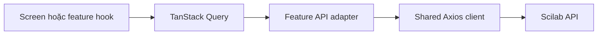

# Kiến trúc Mobile Foundation

**Ngày cập nhật**: 2026-06-27

**Áp dụng cho**: `apps/mobile`

**Trạng thái**: Đã setup foundation, chưa triển khai auth hoặc UI

## 1. Phạm vi nhánh

Nhánh `feat/mobile-fe-foundation` chỉ thiết lập nền móng dùng chung cho mobile:

- Expo Router và root provider tối thiểu;
- Axios client chuẩn hóa kết nối Scilab API;
- TanStack Query cho server state;
- TypeScript path alias, environment config và quality scripts;
- cấu trúc thư mục sẵn sàng để feature branch mở rộng.

Auth, article, PDF, citation graph và visual design đều nằm ngoài phạm vi nhánh.

## 2. Công nghệ hiện tại

| Mục đích       | Công nghệ                      | Quyết định                                            |
| -------------- | ------------------------------ | ----------------------------------------------------- |
| Mobile runtime | Expo SDK 54, React Native 0.81 | Giữ project hiện tại                                  |
| Ngôn ngữ       | TypeScript 5.9                 | Strict typing và type-check trong CI                  |
| Routing        | Expo Router 6                  | `app/` chỉ chứa route/layout                          |
| HTTP client    | Axios                          | Base URL, timeout, interceptor và error normalization |
| Server state   | TanStack Query                 | Cache, retry, mutation và invalidation                |
| Monorepo       | pnpm 9 + Turborepo             | Dùng script và CI chung của repo                      |

Form, validation, local state library và UI kit chưa được chọn hoặc cài trên
nhánh này. Feature branch chỉ thêm dependency khi thực sự sử dụng.

## 3. Cấu trúc hiện tại

```text
apps/mobile/
|-- app/
|   |-- _layout.tsx              # Root provider và navigation stack
|   `-- index.tsx                # Route rỗng, chưa có UI
|-- src/
|   |-- providers/
|   |   |-- app-providers.tsx
|   |   `-- query-provider.tsx
|   `-- shared/
|       |-- api/
|       |   |-- api-error.ts
|       |   |-- api-types.ts
|       |   `-- http-client.ts
|       `-- config/
|           `-- env.ts
|-- .env.example
|-- app.json
|-- package.json
`-- tsconfig.json
```

Không tạo trước thư mục feature rỗng. Ví dụ `src/features/auth` chỉ được thêm ở
nhánh auth; `src/features/articles` chỉ được thêm ở nhánh article.

## 4. Quy tắc networking



- Route và screen không gọi Axios trực tiếp.
- Feature adapter gọi `apiRequest<T>` và chuyển response thành feature model.
- TanStack Query quản lý loading, error, retry, cache và cancellation signal.
- Axios chỉ quản lý transport: base URL, headers, timeout và chuẩn hóa lỗi.
- `EXPO_PUBLIC_API_URL` chỉ chứa public base URL, không chứa secret.
- API key nguồn dữ liệu và database credential không nằm trong mobile bundle.

## 5. Quy tắc mở rộng feature

Mỗi feature branch có thể thêm cấu trúc sau khi spec được duyệt:

```text
src/features/<feature>/
|-- api/
|-- hooks/
|-- types/
|-- screens/       # Chỉ thêm khi bắt đầu UI
|-- components/    # Chỉ thêm khi có component thật
`-- index.ts
```

Feature không import internal file của feature khác. Phần dùng chung chỉ được
đưa vào `src/shared` khi có ít nhất hai consumer hoặc là infrastructure toàn app.

## 6. Chưa làm trên nhánh này

- Auth API, token storage, session provider và protected routes.
- Screen, form, theme, design tokens hoặc visual components.
- OpenAlex/SJR integration, PDF viewer hoặc graph visualization.
- Bookmark, notification, offline persistence hoặc analytics.
