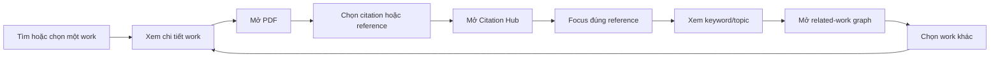

# Mobile FE Product Flow và Lộ trình Module

**Ngày cập nhật**: 2026-06-27

**Trạng thái**: Định hướng FE ban đầu, chưa triển khai

## 1. Phạm vi

Tài liệu này chỉ mô tả trải nghiệm và công việc FE mobile. FE nhận dữ liệu đã
chuẩn hóa từ Scilab API; không crawl OpenAlex/SJR, không đọc graph database trực
tiếp và không xây pipeline parse PDF.

## 2. Chuẩn hóa thuật ngữ trên giao diện

- **Work**: tên chung cho article, dissertation/luận văn, book chapter và các
  loại công trình học thuật khác.
- **Citation marker**: ký hiệu trích dẫn trong nội dung, ví dụ `[12]`.
- **Reference entry**: một mục đầy đủ trong danh mục tài liệu tham khảo.
- **Citation Hub**: màn hình/sheet tập hợp citation và reference của work đang
  xem, cho phép focus đúng mục người dùng đã chọn.
- **Related work**: work khác được API trả về kèm lý do liên quan.
- **SJR zone/quartile**: FE tạm hiển thị Q1–Q4; tên filter cuối cùng cần contract
  nghiệp vụ xác nhận.

## 3. Luồng trải nghiệm mục tiêu

FE phải có fallback rõ ràng khi API không có PDF, citation mapping, keyword hoặc
graph; không tự suy đoán dữ liệu để lấp chỗ trống.

## 4. Bản đồ module FE dự kiến

| Module FE         | Màn hình/hành vi chính                                         | Trạng thái  |
| ----------------- | -------------------------------------------------------------- | ----------- |
| Mobile Foundation | Routing, providers, Axios và TanStack Query                    | Đã setup    |
| Article Discovery | Search, filter, result list, loading/empty/error               | Chưa đặc tả |
| Work Detail       | Metadata, authors, journal rank, keyword/topic, PDF status     | Chưa đặc tả |
| PDF Reader        | Render, page navigation, zoom, giữ vị trí đọc                  | Chưa đặc tả |
| Citation Hub      | Danh sách citation/reference, focus và mở work liên quan       | Chưa đặc tả |
| Research Graph    | Node/edge visualization, pan/zoom, select, legend, explanation | Chưa đặc tả |
| Library           | Bookmark, collection, recent works                             | Sau MVP     |

## 5. Lộ trình FE đề xuất

### Phase FE-0 — Foundation documents

- Chốt flow, route, folder structure, tech stack và API view models FE cần.
- Setup foundation dùng chung, chưa triển khai feature hoặc UI.

### Phase FE-1 — Feature branches

- Mỗi module, bao gồm auth, được triển khai ở branch và spec riêng.
- Feature chỉ sử dụng foundation chung; không đặt business logic trong route.

### Phase FE-2 — Discovery & Work Detail

- Làm search/filter/list/detail dựa trên typed fixtures trước, sau đó nối API.
- Thể hiện rõ source, trạng thái open access, SJR quartile và data unavailable.
- Chuẩn hóa skeleton, empty, error, retry và pagination.

### Phase FE-3 — PDF Reader & Citation Hub

- Chạy technical spike để chọn PDF renderer tương thích iOS/Android.
- Nhận citation anchors/reference entries đã parse từ API.
- Khi người dùng chọn citation/reference, mở hub và focus đúng item.

### Phase FE-4 — Research Graph

- Nhận graph payload giới hạn node/edge từ API.
- Render graph nhỏ quanh work gốc; hỗ trợ select, pan/zoom và mở work detail.
- Hiển thị “liên quan vì…”; vị trí node không được ngụ ý chất lượng bài báo.

### Phase FE-5 — Library & Polish

- Bookmark, recent works, collections và accessibility/performance pass.
- Bổ sung E2E cho các journey quan trọng.

## 6. Phạm vi vòng đầu

Vòng đầu chỉ triển khai **Mobile Foundation**. Auth, article, PDF, citation và
graph được thực hiện ở các feature branch riêng, với spec và contract tương ứng.

## 7. FE cần team backend/product cung cấp sau này

- Search filters và work view models đã chuẩn hóa.
- URL/quyền truy cập PDF; citation anchors và reference mapping nếu có.
- Graph nodes/edges đã giới hạn, kèm relationship type và explanation.
- Quy ước SJR “zone/quartile”, giá trị thiếu và năm ranking.
- Fixtures đại diện cho success, empty, partial data và error.
